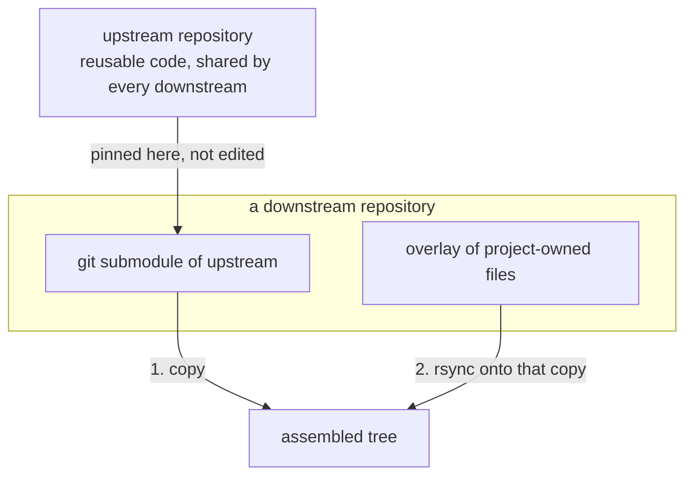
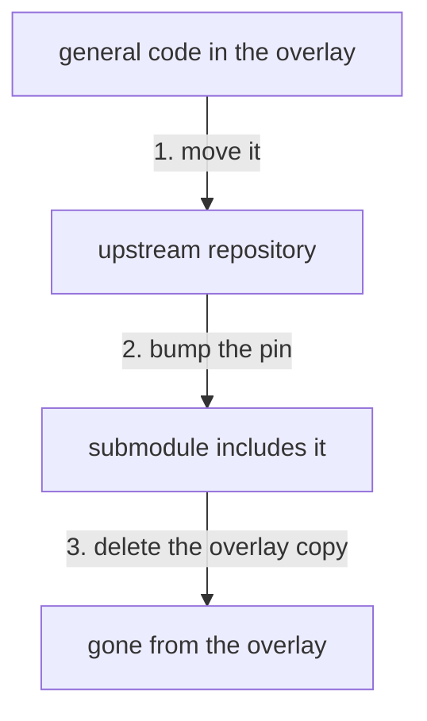

# /distill

## Overview

The basic setup is that you have a core code base (the "upstream" repository) with background intellectual property, re-usable functionality, or common code. Then, you want to use it and customize it for various specific projects (the "downstream" repositories), perhaps with their own proprietary intellectual property and code.

One setup may entail the upstream repository being a git sub-module of the downstream repository, and a script which copies the upstream and then modifies specific files (e.g. with `rsync`) so that the re-usable pieces of the upstream code is not affected, but downstream and make modifications.

This could look something like this:

To _distill_ is to clearly and cleanly separate which code belongs upstream versus downstream, and to move common functionality and code (which not specific to a downstream project but more general intellectual property) into the upstream repository.

## How to distill

General code that is sitting in the overlay moves upstream. Delete the overlay copy only after the submodule pin includes it, so the build copy still supplies it and the overlay rsync no longer replaces it.

