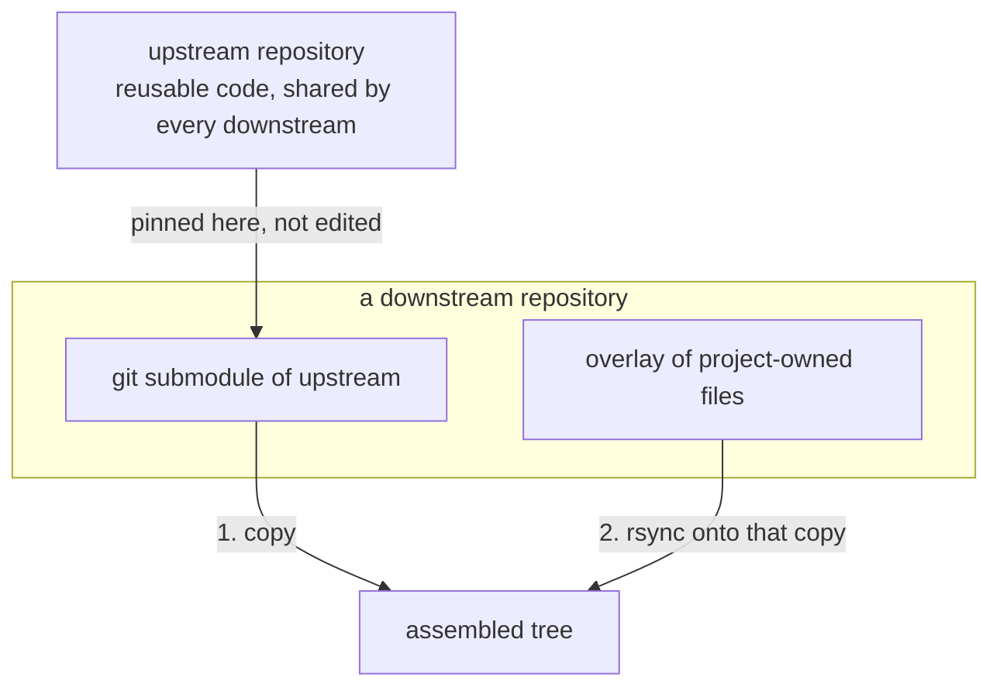
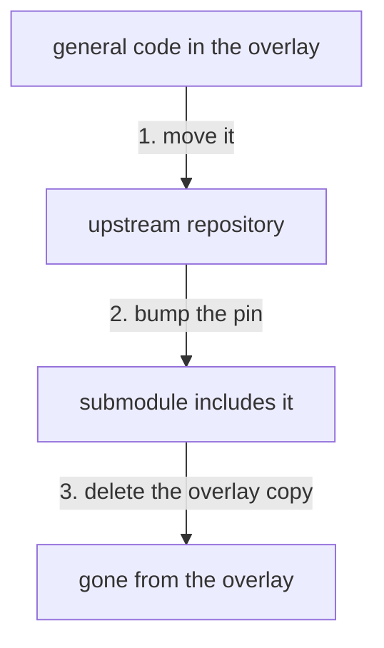
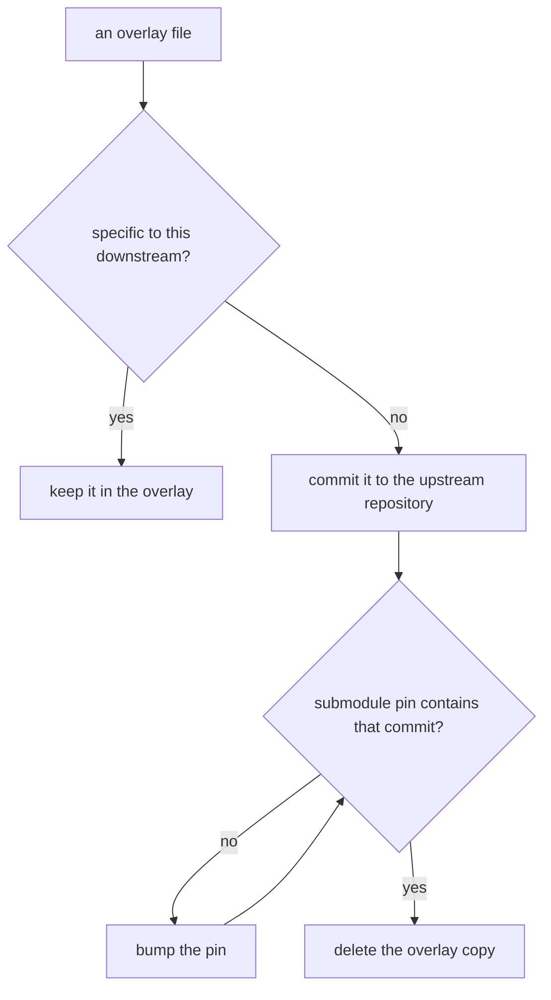

# /distill

## Why to distill?

The basic setup is that you have a core code base (the "upstream" repository) with background intellectual property, re-usable functionality, or common code. Then, you want to use it and customize it for various specific projects (the "downstream" repositories), perhaps with their own proprietary intellectual property and code.

One setup may entail the upstream repository being a git sub-module of the downstream repository, and a script which copies the upstream and then modifies specific files (e.g. with `rsync`) so that the re-usable pieces of the upstream code is not affected, but downstream and make modifications.

This could look something like this:

To _distill_ is to clearly and cleanly separate which code belongs upstream versus downstream, and to move common functionality and code (which not specific to a downstream project but more general intellectual property) into the upstream repository.

## How to distill?

### General Instructions

Look for generic functionality in downstream repositories, and wonder if any could be re-usable which belongs in upstream. Often, legal requirements may need any project-specific functionality to be delivered in the downstream repository, so you must consider carefully if something is intellectual property for a downstream user and cannot legally be distilled upstream. However, there is often more that can be distilled upstream than you think. There are general functionalities and utilities and common code patterns which are not downstream-specific but falsely live in downstream.

This requires reviewing downstream code (perhaps from multiple repositories) and comparing it upstream code, and seeing where that distillation boundary should really lie. Catalogue potential places that could be affected, and look at the overall catalogue before deciding.

In addition, look for opportunities to refactory downstream code bases so that it's easier to distill. For instance, by collecting common function parameters into a configuration object that is passed around, this may unlock new distillation opportunities even if the original code itself was difficult to distill.

### Submodule Pins

General code that is sitting in the overlay moves upstream. Delete the overlay copy only after the submodule pin includes it, so the build copy still supplies it and the overlay rsync no longer replaces it.

Run that path only for general intellectual property, and only in that order. Project-specific code never enters it. Do not delete the overlay copy while the pin check is still no.

### Shattering

Sometimes if there is a really long upstream file, and the downstream overlay only modifies a very small part of that file, instead of needing to overwrite the entire file downstream, it could be distilled by shattering that file into multiple smaller files first. Then, let's say you take a thousand line file and shatter it into ten different files, each a hundred lines, nine of those do not need to be overlaid at all, and only the one small file which needs the change had to be overlaid from upstream. This allows more re-usable code upstream.
